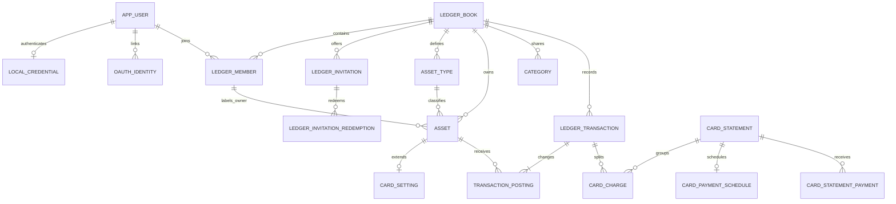

# Dondok 데이터베이스 설계 v0.6

## 1. 확정된 제품 원칙

- 로그인 아이디는 인증 전용이며 다른 사용자에게 노출하지 않는다.
- 공개 핸들·사용자 검색 없이 초대 URL과 직접 입력 코드를 제공한다.
- 가계부 한 개에 활성 멤버 N명이 참여할 수 있다.
- 한 사용자는 동시에 한 가계부에만 참여할 수 있다.
- 금액은 원화 정수만 지원하고 PostgreSQL `bigint`로 저장한다.
- 경제 활동일은 `date`, 생성·수정 시각은 `timestamptz`다.
- 자산은 소유자를 표시하지만 모든 활성 멤버가 조회하고 거래에서 사용할 수 있다.
- 카테고리는 가계부 공통이다.
- 이체와 카드대금 결제는 수입·지출 통계에서 제외한다.
- 카드 구매는 구매일의 지출 통계에 즉시 포함하고, 결제 계좌 잔액은 결제일에 감소한다.
- 카드대금 결제는 새로운 지출이 아니라 결제 계좌 자산에서 카드 부채로 이동하는 정산 이체다.

실행 스키마의 단일 원본은 [`backend/src/main/resources/db/migration/`](../../backend/src/main/resources/db/migration/)의 순차 Flyway migration이며, 정상·제약 거부 흐름은 [`database/tests/V1__schema_smoke.sql`](../../database/tests/V1__schema_smoke.sql), 전체 삭제 cascade는 [`database/tests/V1__ledger_delete_smoke.sql`](../../database/tests/V1__ledger_delete_smoke.sql)에서 검증한다.

## 2. 도메인 관계



## 3. 회원과 초대

`local_credential.login_id`는 로그인에만 사용하고 다른 사용자에게 노출하지 않는다. 공개 핸들, 사용자 검색, 사용자 목록 API를 만들지 않는다.

초대 URL과 직접 입력 코드를 모두 제공한다. 직접 입력 코드는 숫자 6자리이고 URL에는 별도의 고강도 token을 넣으며, 두 값은 같은 invitation을 가리킨다. 원문은 생성 직후에만 노출하고 발급 후 7일 동안 한 번만 사용할 수 있다.

`ledger_invitation.link_token_digest`와 `direct_code_digest`에는 각 원문의 SHA-256 digest만 저장한다. 두 컬럼은 각각 unique이며 발급은 `INSERT ... ON CONFLICT DO NOTHING`과 제한된 재시도로 동시 중복을 막는다. V17 이전 행은 기존 `code_digest`를 `link_token_digest`로 이름만 바꾸고 `direct_code_digest`를 null로 유지해 아직 유효한 기존 URL·긴 코드를 보존한다. 수락은 초대 행을 잠근 뒤 만료·미사용 상태 확인, 멤버십 생성, 단일 redemption 기록, invitation `REDEEMED` 전이를 한 트랜잭션으로 처리한다. 전역 `ledger_member.user_id` unique가 이미 다른 가계부에 참여한 사용자의 수락 경쟁도 차단한다.

모든 활성 멤버의 권한은 동일하다. `ledger_member`에 역할 컬럼을 두지 않으며 누구나 자산·카테고리·거래·카드 설정과 초대를 같은 권한으로 관리한다. 가계부 생성자는 감사 정보일 뿐 특별 권한을 갖지 않는다.

`ledger_member.user_id`는 전역 unique로 한 사용자의 단일 가계부 참여를 강제한다. 개인 나가기와 `left_at` 상태는 두지 않는다. 가계부 자체를 삭제하면 book 하위 멤버·초대·자산·분류·거래·카드 명세·audit를 `ON DELETE CASCADE`로 모두 물리 삭제한다. 다른 클라이언트는 다음 API 조회에서 `404`를 받으면 해당 가계부 캐시를 비운다.

`ledger_book`은 사용자가 선택하거나 이름으로 구분하는 목록 항목이 아니라 공동 데이터의 소유 경계다. 사용자 지정 이름 컬럼을 두지 않으며 현재 가계부와 초대 대상은 로그인 사용자의 단일 membership과 구성원 목록으로 식별한다.

가계부 전체 삭제는 확인 화면에서 읽은 `ledger_book.id + version`을 현재 membership과 비교하고 대상 행을 잠근 뒤 부모 행 하나를 삭제한다. ID 비교는 오래 열린 탭에서 이전 가계부 삭제 후 새 가계부를 만든 ABA 경합을 차단한다. 멤버 참여와 초대 발급·취소는 이 version을 증가시켜 공유 구조가 달라진 삭제 snapshot을 거부하되, 서로 다른 거래 row의 수정까지 book version으로 직렬화하지 않는다. `book_id`를 가진 모든 업무 테이블의 `ON DELETE CASCADE`가 같은 트랜잭션에서 하위 데이터를 제거하며, `app_user`, 인증 credential과 Spring Session은 가계부 소유 경계 밖이라 남는다. 별도 soft-delete 사본이나 서비스 DB tombstone은 만들지 않고, 백업의 최대 30일 보존과 복구 시 삭제 재적용은 운영 절차로 다룬다.

## 4. 자산과 소유권

자산 소유 형태는 MVP에서 두 가지다.

- `PERSONAL`: 특정 `owner_member_id` 필수
- `JOINT`: 가계부 공동 소유, owner는 null

소유 표시는 명의와 통계 구분을 위한 마커이며 ACL이 아니다. 모든 활성 멤버가 개인·공동 자산을 동일하게 등록·수정·보관하고 거래에 선택할 수 있다. A 소유 카드의 결제 계좌로 B 소유 또는 공동 소유 계좌를 지정하는 것도 허용한다. 일부 멤버만 공동 소유하거나 지분율이 필요해질 때만 별도 owner N:M 테이블을 추가한다.

자산 종류의 사용자 표시명과 기능은 분리하되 종류 집합은 고정 시스템 코드로 관리한다.

- `asset_type.name`: 사용자가 보는 이름
- `asset_type.behavior`: `STANDARD`, `CREDIT_CARD`, `DEBIT_CARD`, `SAVINGS`
- `payment_source_capable`: 카드 결제·적금 자동이체 출금 계좌 후보 여부
- 신용카드 특수 필드: `card_setting` 1:1 확장 테이블
- 체크카드 결제 계좌: `debit_card_setting` 1:1 확장 테이블
- 적금의 선택 자동이체 계좌·달력일: 설정할 때만 생성하는 `savings_setting` 0..1 확장 테이블

사용자 정의 자산 종류는 두지 않고 `asset_type.system_code`는 필수다. `기타`는 `현금`과 동일하게 `STANDARD`, `payment_source_capable = false`인 현금성 종류다. 개별 용도는 `asset.name`으로 표현한다. 기존 사용자 정의 종류는 같은 가계부의 `OTHER`로 재지정한 뒤 제거하되 자산과 거래·posting은 유지한다. `BANK`의 표시명은 `계좌`, `SAVINGS`는 `적금`이다. 마이너스 통장은 별도 물리 종류가 아니라 signed 잔액이 음수인 `BANK` 계좌이며 일반 계좌와 같은 결제·이체 기능을 사용한다. 기능은 표시명이나 잔액 부호가 아니라 behavior가 결정한다. 연결 설정의 대상과 출금 계좌는 composite FK로 같은 가계부임을 보장하고 서로 같은 자산일 수 없다. V9·V10은 기존 `BANK` 유형의 표시명만 `계좌`로 바꾸고 사용자가 입력한 `asset.name`은 보존한다. V16은 기존 `OVERDRAFT` 자산의 ID·이름·소유자·posting·연결 설정을 유지한 채 같은 가계부의 `BANK` 유형으로 재지정하고 `OVERDRAFT` 유형과 허용 코드를 제거한다. 자산 version만 증가시켜 이전 화면의 stale 저장을 거부하며 잔액은 기존 posting 합계를 그대로 사용한다.

신규 가계부 생성 트랜잭션은 자산 유형 bootstrap 뒤 `CASH`, `BANK`, `CREDIT_CARD`, `DEBIT_CARD` 자산을 생성자 `PERSONAL` 소유로 하나씩 생성한다. 금액은 모두 0원이어서 `OPENING_BALANCE` 거래와 posting을 만들지 않고, 등록일은 `Asia/Seoul` 기준 가계부 생성일이다. 신용카드와 체크카드 설정은 동일 트랜잭션에서 기본 `BANK` 자산을 참조한다. 기존 가계부는 이 네 자산을 backfill하지 않고, 기본 자산도 활성 50개 한도에 포함한다.

### 자산 삭제·보관 계약

자산은 카테고리처럼 다른 자산으로 일괄 치환하면 잔액과 현금흐름이 훼손되므로 처리 방식이 달라야 한다.

- 물리 삭제/보관 분기의 거래 이력은 soft delete 여부와 관계없이 대상 자산을 참조하는 `transaction_posting.asset_id` 또는 `ledger_transaction.primary_asset_id`의 distinct 거래로 계산한다.
- 이력이 0건이면 대상 자체의 `card_setting`, `debit_card_setting`, `savings_setting`과 함께 물리 삭제하고, 1건 이상이면 `asset.archived_at/archived_by_member_id`만 기록한다.
- 활성 신용카드의 `settlement_asset_id`, 활성 체크카드의 `payment_asset_id`, 활성 적금의 `transfer_asset_id`로 참조되거나 `SCHEDULED/PROCESSING/FAILED` 카드 결제 schedule의 `settlement_asset_id`이면 연결을 먼저 바꿀 때까지 차단한다. 이미 보관된 자산의 비활성 설정 참조는 blocker가 아니지만 대상의 물리 삭제를 막고 함께 보관 상태로 남겨 FK와 과거 설정을 보존한다. 완료·취소 schedule과 대상 카드 자신의 미결제 명세는 blocker가 아니다.
- 잔액과 대상 카드의 미결제 명세 수는 경고이며 0원·결제 완료를 강제하지 않는다. 보관 카드의 기존 명세·schedule은 계속 정산한다.
- 보관 자산은 활성 50개, 활성 그룹과 신규 거래·출금원 선택기에서 제외하지만 posting과 소유 marker를 유지해 순자산·과거 거래·통계에 계속 포함한다.
- 보관 목록·상세 조회를 위해 상태 조건 조회를 제공하고 상세는 읽기 전용으로 둔다. MVP에는 `archived_at`을 null로 되돌리는 restore command를 제공하지 않는다.

삭제 command는 자산 행을 잠근 뒤 preview의 version·분기·이력·잔액·연결 상태를 같은 트랜잭션에서 다시 계산한다. 하나라도 달라지면 `412`로 전체를 거부하고, blocker가 남아 있으면 `409`로 거부한다. FK는 과거 posting·거래·명세를 보존하는 자산의 물리 삭제를 최종 방어하며 application은 FK 오류에 의존하지 않고 먼저 `ARCHIVE`를 선택한다.

개인 나가기를 제공하지 않으므로 탈퇴 전 자산 이전 상태는 만들지 않는다.

한 가계부의 활성 자산은 최대 50개다. 자산 생성 시 가계부 행을 잠그고 활성 자산 수를 확인해 동시 생성으로 50개를 넘지 않게 하며, DB 전체 count trigger는 두지 않는다. 51번째 생성은 안정된 도메인 오류로 거부한다.

## 5. 공동 카테고리와 삭제

카테고리는 가계부 단위이며 모든 멤버의 거래와 통계에 공통 적용된다. 수입/지출 방향마다 fallback 카테고리를 하나씩 만든다.

- `INCOME + OTHER`: 기타 수입
- `EXPENSE + OTHER`: 기타 지출
- fallback은 시스템 코드와 역할을 유지하며 삭제할 수 없음
- 표시명 변경 허용 여부는 UI 정책으로 제한 가능

일반 카테고리 삭제는 한 서비스 트랜잭션에서 처리한다.

1. 삭제 대상과 같은 방향의 fallback을 잠금 조회
2. 해당 카테고리를 참조하는 모든 거래의 `category_id`를 fallback으로 bulk update
3. 거래 version/updated 정보 갱신
4. 대상 카테고리를 archive
5. 영향 건수와 기간을 audit에 기록

카테고리는 balance를 만들지 않는 분류 태그이므로 이런 재배치가 가능하다. 삭제 전에 “기존 128건이 기타 지출로 이동합니다”처럼 영향 건수를 보여주고, 실행 결과에는 실제 이동 건수와 날짜 범위를 반환한다. MVP에는 별도 숨기기 상태를 만들지 않는다.

## 6. 거래와 posting

`ledger_transaction`은 날짜, 금액, 카테고리, 거래 주체, 작성자를 저장한다. 실제 잔액 변화는 `transaction_posting.delta_won`이 원본이다. 이체와 내부 `OPENING_BALANCE` 조정에는 카테고리를 두지 않는다.

| 거래 | Posting | 통계 |
|---|---|---|
| 수입 | 대상 자산 `+amount` | 수입 포함 |
| 지출 | 결제 자산 `-amount` | 지출 포함 |
| 일반 이체 | 출발 `-amount`, 도착 `+amount` | 제외 |
| 카드 구매 | 카드 자산 `-amount` | 구매일 지출 포함 |
| 카드 환불 | 미결제 카드·원 결제 계좌 `+amount` | 환불일 지출에서 차감 |
| 카드대금 결제 | 은행 `-amount`, 카드 `+amount` | 제외 |

최초 금액이 0이 아니면 자산 생성과 같은 트랜잭션에서 내부 `OPENING_BALANCE` 조정 거래와 posting을 만든다. 현재 잔액과 날짜별 잔액은 유효한 posting 합계다. 등록일 이전 거래도 허용하며 등록일 변경은 opening posting의 날짜를 함께 바꾼다. 잔액 컬럼을 매 거래마다 직접 덮어쓰지 않는다.

사람 관련 값도 분리한다.

- `performed_by_member_id`: 누구의 수입·지출 또는 누가 실행한 일반 이체인지
- `created_by_member_id`: 앱에 최초 입력한 멤버
- `updated_by_member_id`: 마지막 수정 멤버
- 자동 카드 정산은 작성자와 거래 주체가 없고 `source_type=CARD_AUTOPAY`
- 카드 선결제는 실행자를 `created_by_member_id`로 남기지만 거래 주체는 없음

작성자는 감사 정보이며 소비 통계는 `performed_by_member_id`를 기준으로 한다. 수입·지출·일반 이체의 거래 주체는 같은 가계부의 멤버 한 명을 필수로 지정하고 공동·분할 attribution scope는 만들지 않는다. 카드 정산·선결제는 결제 계좌가 자금 출처인 통계 제외 자산 이동이므로 거래 주체를 두지 않는다.

사용자가 직접 만드는 `TRANSFER/NORMAL`의 두 posting 자산은 모두 활성 `asset_type.system_code=BANK` 계좌여야 한다. 이 유형 일관성은 여러 테이블을 조회해야 하므로 단순 DB `CHECK`로 중복하지 않고 transaction application service가 같은 가계부·활성 상태와 함께 검증한다. 카드 정산·선결제처럼 별도 subtype과 전용 command를 쓰는 시스템 이체는 각 정책이 허용 자산을 검증한다.

자산 소유자를 다른 구성원으로 변경할 때 사용자가 동의하면 해당 자산의 삭제되지 않은 수입·지출 거래 `performed_by_member_id`를 새 소유자로 한 트랜잭션에서 bulk update한다. 이체·카드 정산은 통계 대상이 아니므로 자동 변경하지 않는다. 공동 소유로 바꾸면 공동 거래 주체가 없으므로 기존 거래 주체를 유지한다.

거래별 posting 개수와 부호는 `TransactionPostingPolicy`가 생성하고 application service가 검증한다. PostgreSQL에는 PK/FK/unique/0이 아닌 금액만 강제한다. 하나의 Spring 애플리케이션만 DB를 쓰는 초기 구조에서 모든 거래마다 deferred trigger로 다시 계산하는 것은 과한 검증으로 판단했다.

거래 삭제 API는 단순하게 제공하고 DB에서는 `deleted_at` soft delete를 사용한다. 잔액과 통계는 삭제 거래의 posting을 제외한다. 카드 구매는 `기록 정정`과 `환불 처리`를 별도 command로 둔다. 기록 정정은 원 결제일 기준으로 원거래·charge·명세·정산을 소급 교정한다. 실제 환불은 원 구매·결제 이력을 보존하고 환불일 통계를 상쇄하며, 미결제분은 카드 부채를 줄이고 결제 완료분은 최신 결제부터 실제 원 결제 계좌로 반환한다. 카드·계좌 posting, `card_charge`와 statement 변경은 한 application transaction에서 처리한다.

일반 수입·지출·이체 수정은 원 거래 행을 잠그고 편집 시작 `version`을 비교한 뒤, 같은 DB 트랜잭션에서 거래 필드와 posting을 함께 다시 만든다. 거래 유형은 수정할 수 없다. 체크카드 지출이 같은 체크카드를 유지하면 이후 연결 계좌 설정이 바뀌었더라도 기존 posting 계좌를 보존하고, 다른 체크카드로 변경할 때만 새 카드의 현재 연결 계좌를 사용한다. 신용카드 구매와 자동 정산 거래는 일반 수정·삭제 API에서 거부하고 전용 정정·환불 command로 넘긴다.

## 7. 카드 구매, 명세, 결제 예정액

카드 구매와 카드대금 결제를 같은 지출로 다루지 않는다.

### 카드 구매

카드로 20만원을 2개월 할부 구매하면 구매일에 다음이 동시에 저장된다.

- `ledger_transaction.type=EXPENSE`
- 카드 자산 posting `-200000`
- 소비 통계 `+200000`
- 구매 전체 금액의 카드 posting과 별개로 회차별 `card_charge` 두 행 생성
- 각 charge에 `installment_no/count`, 회차 원금, 귀속 명세, `expected_settlement_on` 저장

은행 잔액은 이 시점에 변하지 않는다. 카드 자산이 20만원 음수가 되어 부채가 늘고, 순자산은 구매 시점에 즉시 줄어든다.

`card_purchase_billing_snapshot`은 구매 당시의 카드·마감일·결제일·결제 월 offset·할부 수를 보존해 나중의 카드 설정 변경이 과거 관리 화면과 정정 기준을 바꾸지 않게 한다. `card_purchase_refund`는 원 구매·환불 거래를 연결하고, `card_purchase_refund_charge`는 할부 charge별 환불액, `card_purchase_refund_payment`는 실제 statement payment별 계좌 반환액을 보존한다. 이 배분 행들은 원 구매·결제 이력을 덮어쓰지 않고 유효 청구액과 유효 결제액을 계산하는 근거다.

### 체크카드 구매와 적금 연결 설정

체크카드 지출은 `ledger_transaction.primary_asset_id`에 사용자가 선택한 체크카드를 보존하되 posting은 `debit_card_setting.payment_asset_id`의 연결 계좌에 직접 `-amount`로 기록한다. 체크카드 자체에는 중복 posting하지 않아 순자산이 한 번만 감소한다. 적금은 `savings_setting` 행이 없으면 자동이체 미설정으로 해석한다. 설정할 때만 출금 계좌와 달력일을 한 행에 모두 보존하며 금액·시작일·catch-up 정책이 확정되기 전에는 schedule이나 거래를 자동 생성하지 않는다.

### 결제 예정 표시

카드 설정은 마감일, 결제일, 결제 월 offset, 결제 계좌, 자동 정산 여부를 가진다. 결제 계좌는 자동 정산 사용 여부와 무관하게 필수이며 구매일로부터 열린 명세의 cycle과 예상 결제일을 계산한다. 과거에 허용한 결제 계좌 누락 행은 자동 backfill하지 않고 `NOT VALID` check로 신규·수정부터 차단한 뒤 사용자가 상세에서 실제 계좌를 지정하게 한다.

- 마감 전: 연결된 할부 회차 원금 합계로 미확정 예상액 계산
- 마감 후: `billed_amount_won`으로 확정
- 성공한 선결제·정규 결제는 `card_statement_payment`에 누적
- 카드 상세: 청구 원금, 결제 완료액, 남은 결제액, 결제 예정일
- 은행 상세: 현재 잔액, 연결된 모든 카드 예정액, 예상 결제 후 잔액

카드 설정을 변경해도 기존 charge의 예상 결제일과 확정 명세에는 소급 적용하지 않는다.

### 선결제와 결제일 정산

사용자는 명세의 남은 금액 이하에서 원하는 금액을 여러 번 선결제할 수 있다. 선결제는 `TRANSFER + CARD_PREPAYMENT`, 결제일 자동 정산은 `TRANSFER + CARD_SETTLEMENT` 거래를 만든다.

- 은행 `-200000`
- 카드 `+200000`
- 카드 부채는 0에 가까워짐
- 수입·지출 통계 변화 없음
- 순자산 변화 없음

선결제와 자동 정산은 실제 은행 API를 호출하는 기능이 아니라 장부에 완료를 기록하는 기능이다. 로컬 서버가 결제일에 꺼져 있을 수 있으므로 worker는 `scheduled_on <= 오늘`인 미처리 schedule을 따라잡는다.

- statement를 행 잠금
- `남은 금액 = 청구 원금 - 삭제되지 않은 성공 결제 합계` 재계산
- 선결제는 요청 금액이 남은 금액 이하인지 확인하고 payment 행 추가
- 정규 결제는 남은 전액으로 한 번만 생성하도록 partial unique 적용
- `source_type=CARD_PREPAYMENT` 또는 `CARD_AUTOPAY` unique source로 재시도 중복 차단
- schedule 단위 작은 트랜잭션
- 남은 금액이 0이고 명세가 확정됐다면 statement `PAID`
- 결제 계좌 장부 잔액과 관계없이 남은 전액을 기록하고 음수 잔액 허용

카드 구매는 일시불·할부를 지원하고 할부 이자는 자동 계산하지 않는다. 카드의 음수 opening posting은 `OPENING_BALANCE` origin의 1회 charge로 마감·결제 설정에 따른 명세에 포함하고 과거 due date면 catch-up worker가 처리한다. 장부 잔액 부족은 실패가 아니며 기술 오류만 재시도한다.

결제 월의 29~31일이 없으면 말일로 보정한 뒤 `Asia/Seoul` 기준 한국 영업일 달력을 적용한다. 그 날짜가 주말 또는 공휴일이면 다음 한국 영업일까지 순연한다. 주말은 계산하고 공휴일·대체공휴일·임시공휴일은 `korean_public_holiday`에 연도별로 저장한다. 데이터 원본은 [한국천문연구원 특일 정보 OpenAPI](https://www.data.go.kr/dataset/15012690/openapi.do)와 [관공서의 공휴일에 관한 규정](https://www.law.go.kr/lsInfoP.do?lsId=002404)이다. 확정된 `due_on`은 과거 명세에 저장한다.

## 8. 통계와 조회

통계는 제외 목록이 아니라 포함 목록으로 작성한다.

기본 화면에는 멤버·거래 주체·자산 소유자 필터를 자동 적용하지 않고 가계부 전체를 보여준다. 개인/공동/멤버별 통계는 사용자가 명시적으로 필터를 선택했을 때만 계산한다.

MVP 통계는 선택 월 수입·지출·순액과 카테고리 비중, 선택 월이 속한 연도의 1~12월 수입·지출 합계를 제공한다. 일별 거래는 통계에서 중복 집계하지 않고 홈의 일별 원장에서 조회한다. 거래 목록은 날짜·ID 기반 cursor pagination으로 필요한 범위만 조회하고, 달력·통계는 시작일과 종료일이 있는 bounded query만 허용한다. JPA `LAZY` 연관관계를 순회해 목록을 만드는 대신 projection과 명시적 SQL로 N+1과 전체 원장 로드를 피한다.

월간 통계는 `ledger_financial_activity`가 노출하는 `primary_asset_id`를 자산 소유 marker 필터에 사용한다. 체크카드 지출도 실제 posting 계좌가 아니라 사용자가 선택한 체크카드의 소유 marker로 귀속하고, 개인 소유는 `asset.owner_member_id`, 공동 소유는 `asset.ownership_scope = 'JOINT'`의 현재 값을 적용한다. 거래 주체·자산 소유자·분류 필터는 모두 같은 가계부에 속하는지 먼저 확인한 뒤 AND로 조합한다. 선택 월 합계·분류는 월 범위 `GROUPING SETS`, 연간 막대는 같은 연도의 `date_trunc('month')` group query로 제한한다. 두 query는 read-only repeatable-read transaction에서 같은 MVCC snapshot을 공유하고 application layer는 누락된 달만 0으로 채워 항상 12개를 반환한다. 실제 실행 계획에서 병목이 확인되기 전에는 새 통계 전용 인덱스나 materialized view를 추가하지 않는다.

```sql
sum(case
      when transaction_type = 'EXPENSE' and source_type = 'CARD_REFUND' then -amount_won
      when transaction_type = 'EXPENSE' then amount_won
      else 0
    end)
where occurred_on >= :startDate
  and occurred_on < :endDate
  and deleted_at is null
```

따라서 일반 이체와 카드대금 정산은 새로운 subtype이 추가되어도 소비 통계에 들어오지 않는다.

자산 현황의 총자산·총부채·순자산은 `status=ALL` 자산의 `asset_current_balance.current_balance_won` 부호를 기준으로 프론트에서 선형 계산하고, 화면 그룹·그룹 합계·활성 개수는 그중 `ACTIVE`만 사용한다. 따라서 보관으로 현재 장부 가치나 과거 통계가 사라지지 않는다. 이번 달과 다음 달 카드 결제 금액은 활성·보관을 포함해 기존 명세 projection을 다음과 같은 bounded batch query로 함께 읽어 보관 카드의 남은 정산도 숨기지 않는다.

```sql
select card_asset_id,
       sum(payment_amount_won) filter (where due_on < :nextMonthStart)
         as current_month_payment_due_won,
       sum(payment_amount_won) filter (where due_on >= :nextMonthStart)
         as next_month_payment_due_won
from card_statement_forecast
where book_id = :bookId
  and card_asset_id = any(:cardAssetIds)
  and status in ('OPEN', 'FINALIZED')
  and due_on >= :monthStart
  and due_on < :afterNextMonthStart
group by card_asset_id;
```

`:cardAssetIds`는 전체 조회에 포함된 활성·보관 신용카드 ID로 제한하고 미결제 상태인 `OPEN`, `FINALIZED`만 골라 `(card_asset_id, status, due_on)` 인덱스를 활용한다. `payment_amount_won`은 OPEN 명세의 유효 charge 원금(환불 charge 배분 차감) 또는 FINALIZED·PAID의 확정 snapshot(환불 차감)에서 환불로 돌려준 금액을 제외한 유효 선결제·정규 결제를 뺀 남은 금액이다. 화면 전용 누적 합계, materialized view, Redis cache를 추가하지 않는다. 월 경계는 `Asia/Seoul`의 `LocalDate` 반개구간으로 전달하고 비카드·결과가 없는 카드는 application layer에서 두 값 모두 0으로 채운다. 현재 ordinary view의 charge/payment CTE는 장기 이력이 커지면 전체 aggregate가 병목이 될 수 있으므로 query time과 rows를 관찰하고, 실제 병목이 확인되면 outer index를 추가하기보다 먼저 대상 statement ID를 제한한 뒤 charge/payment를 집계하도록 projection SQL을 재작성한다.

핵심 인덱스:

- 일별 목록: `(book_id, occurred_on desc, created_at desc, id desc)`
- 소비 통계: `(book_id, occurred_on, category_id, performed_by_member_id)` partial index
- 분류 사용량·삭제 이동: `(book_id, category_id, id) include (occurred_on)` partial index
- 자산 잔액: `(book_id, asset_id, transaction_id) include (delta_won)`
- 결제 예정: `(card_asset_id, status, due_on)`
- 자동 정산: `(scheduled_on, next_retry_at, id)` pending partial index
- 결제 합계: `card_statement_payment(statement_id, paid_on, id)`

초기에는 PostgreSQL 집계로 충분하다. 병목이 확인된 후에만 일별 잔액·월별 카테고리 projection을 추가한다. Redis는 원장이나 잔액의 source of truth로 사용하지 않는다.

`card_statement.billed_amount_won`은 통계 성능용 누적값이 아니라 확정된 카드 명세의 업무 snapshot이다. 월별 통계와 혼용하지 않는다. 통계 projection이 나중에 필요해져도 원거래에서 재생성할 수 있는 파생 데이터로 두고 원장 source of truth로 사용하지 않는다.

## 9. 동시성 경계

- 일반 엔티티 수정: JPA `@Version`
- 중복 생성: `Idempotency-Key`와 DB unique
- 초대 수락: invitation 행 잠금 + membership/redemption unique
- 카테고리 삭제: 대상/fallback 잠금 + bulk remap 한 트랜잭션
- 자산 삭제·보관: 대상 자산 잠금 + expected version·preview token 재검증
- 명세 확정/선결제/정산: statement 행 잠금 + source unique + 정규 결제 partial unique
- 공유 수정: 편집 시작에 읽은 aggregate version과 저장 요청의 expected version 비교

version이 다르면 `412 VERSION_CONFLICT`로 전체 저장을 거부하고 DB를 변경하지 않는다. 같은 row가 아닌 수정까지 직렬화하지 않는다. 작성 세션은 command 응답으로 캐시를 갱신하고 다른 세션은 화면 진입·focus·사용자 새로고침에서 최신값을 조회한다. MVP에는 sync outbox와 SSE를 두지 않는다.

PostgreSQL 기본 `READ COMMITTED`를 유지한다. 전체 시스템을 `SERIALIZABLE`로 올리거나 모든 조회에 잠금을 걸지 않는다.

## 10. 검증 원칙

DB가 강제할 것:

- PK, FK, composite FK, unique
- 초대 URL token digest·6자리 직접 코드 digest와 단일 가계부 멤버십 중복
- KRW 금액 양수와 posting 0 금지
- 개인/공동 자산의 owner null 규칙
- 자동 정산과 결제 계좌 관계
- 체크카드·적금 설정의 같은 가계부 연결 FK, 자기 연결 금지와 자동이체일 범위
- statement 날짜 순서와 중복 명세·정산
- 할부 회차 번호·원금, 명세당 정규 결제 한 건

서비스가 검증할 것:

- 활성 가계부 멤버 여부
- 자산·분류·거래 주체가 같은 가계부에 속하는지
- 신용카드·체크카드·적금 behavior와 연결 계좌 capability
- 거래 유형별 posting 형태
- archive 자원의 신규 사용
- finalized/paid 카드 구매 수정 정책
- 단일 가계부 membership과 가계부 전체 삭제 경계
- 명세 잠금 후 남은 금액 이하의 부분 선결제
- 활성 자산 50개 제한과 동시 생성 경쟁
- 자산 정리 preview 이후 이력·잔액·출금원 연결 변경과 archive 자원의 수정·신규 사용

UI 경고면 충분한 것:

- 잔액이 남은 자산 보관
- 미결제 명세가 남은 카드 보관
- 소유자와 거래 주체가 다른 입력
- 평소보다 큰 지출

## 11. 남은 제품 결정

G1 데이터·핵심 계약은 답변을 완료했다. 이후 기능 구현에 필요한 Q-015~Q-023과 운영 결정은 중복 목록을 만들지 않고 [`../product/open-decisions.md`](../product/open-decisions.md)에서 관리한다.
